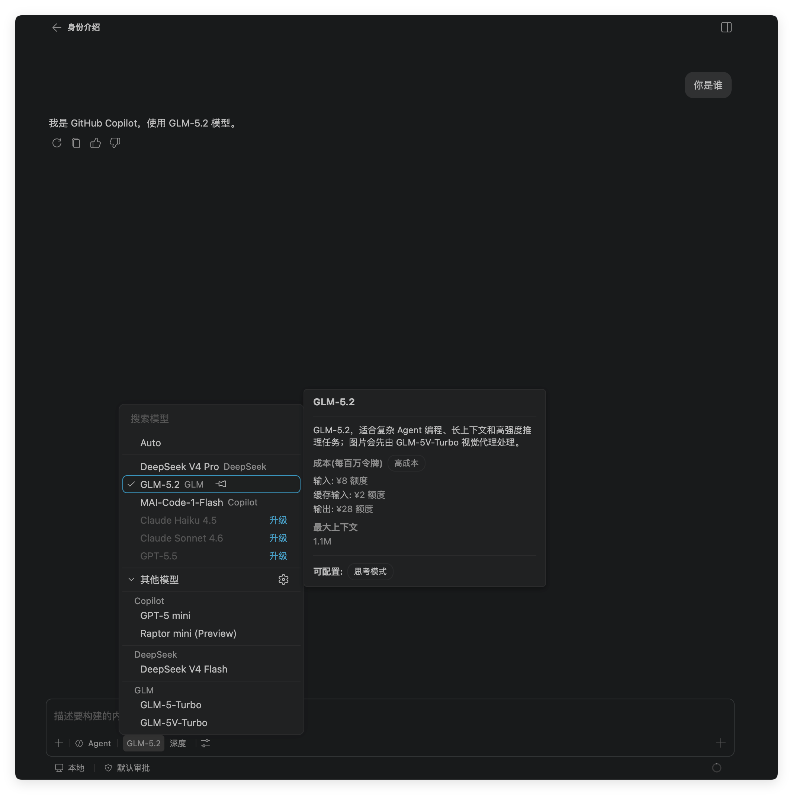
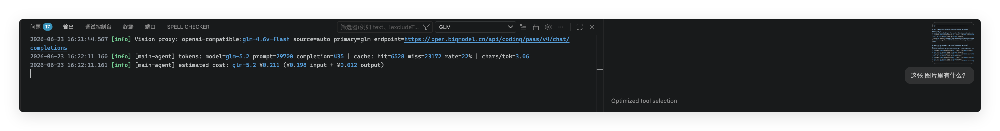
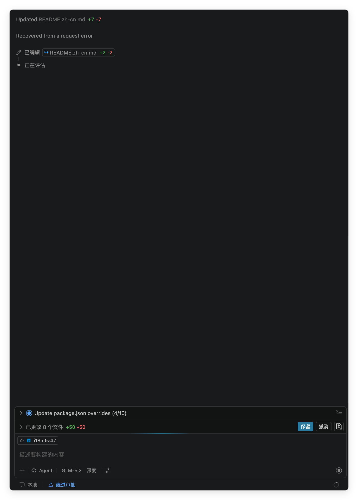

<h1 align="center">GLM for Copilot Chat</h1>

<p align="center">
  <!-- marketplace-readme:remove-start -->
  <a href="https://marketplace.visualstudio.com/items?itemName=ikaros.glm-for-vscode-copilot"></a>
  <br/>
  <!-- marketplace-readme:remove-end -->
  
  
</p>

<p align="center">
  <a href="https://github.com/umbrella22/glm-for-copilot/blob/main/README.md">English</a> |
  简体中文
</p>

**在 Copilot Chat 模型选择器中直接使用 GLM——无需离开你熟悉的 Copilot 工作流。**

<p align="center">
  
</p>

喜欢 GLM 的性价比，但不想放弃 GitHub Copilot 的 Agent 模式、工具调用和成熟的交互体验？本扩展将 **GLM-5.2、GLM-4.6V-Flash、GLM-5V-Turbo 和 GLM-5-Turbo** 直接接入 Copilot Chat 模型选择器，支持**视觉识别**、**思考模式**，使用你自己的 API Key。

## 为什么选这个扩展？

- **不是替换 Copilot，而是增强它。** 没有新的侧边栏，没有新的聊天界面需要学习。只是在你已经在用的模型选择器中多了一个选项。
- **Agent 模式、工具调用、Instructions、MCP、Skills——全部正常运作。** Copilot 的完整能力栈，现在跑在 GLM 上。
- **按模型需要处理视觉任务。** GLM-4.6V-Flash 和 GLM-5V-Turbo 默认直接接收图片；GLM-5.2 和 GLM-5-Turbo 默认通过透明视觉代理将图片转换为描述。每个模型也可单独选择 `mcp` 模式，将图片存储到本地供兼容的 MCP 工具读取。
- **按轮次估算费用。** 当 GLM API 返回 usage 时，扩展会按官方标价估算本轮费用，上报到 Copilot usage 元数据、写入日志，并在状态栏显示最近一轮费用。
- **需自行提供 API Key，直接向 GLM 付费。** 你的 API Key，你的账单，你的速率限制。密钥存储在操作系统密钥链中，不会以明文形式写入磁盘。

## 功能特性

### 四款 GLM 模型出现在模型选择器中

四个模型与 GPT-4o、Claude 等并列在 Copilot Chat 的模型选择器中。可在对话中途切换模型，不丢失聊天历史。

### 透明视觉代理

模型使用 `proxy` 模式时，自动视觉代理会优先让 GLM-4.6V-Flash 描述图片，再把描述交给当前选中的 GLM 模型。如果 GLM-4.6V-Flash 在其配置端点不可用，则回退到已安装的 Copilot/VS Code 视觉模型。你也可以通过 **GLM: 在模型管理中打开视觉代理** 强制选择 VS Code 模型或自定义 API 端点。GLM-4.6V-Flash 和 GLM-5V-Turbo 默认使用 `native` 模式，直接接收缩放后的图片数据。

这样 GLM-5.2 可以继续专注编码与推理，视觉抽取交给 GLM-4.6V-Flash。

<p align="center">
  
</p>

### 思考模式与推理深度控制

完整支持 GLM 的 `reasoning_content`。通过 Copilot Chat 模型选择器的菜单选择 `停用`、`标准`（均衡，默认）或 `深度`（适用于复杂 Agent 任务）。

### 继承全部 Copilot 能力

由于本扩展接入的是 Copilot 的原生 provider API，你免费获得完整能力栈：

- **Agent 模式**——自主执行多步骤任务
- **工具调用**——文件编辑、终端操作、工作区搜索、Git、测试
- **Instructions & Skills**——你的 `.instructions.md`、`AGENTS.md` 和各项 Skills 开箱即用
- **Prompt 缓存统计**——在输出通道中记录 GLM 缓存命中率，直观看到成本节省

<p align="center">
  
</p>

### 安全优先

新增或更新的 API Key 会按地区和计费通道隔离存储在 VS Code 的 `SecretStorage` 中（macOS 钥匙串 / Windows 凭据管理器 / Linux 密钥环）。旧版明文设置仅在升级迁移完成前作为兼容回退；模型管理页不会将 Key 写入 `settings.json`。

### 费用可见

每次 GLM 响应完成后，扩展会将用量上报到 Copilot 元数据并写入日志。状态栏主文案跟随当前资源的默认通道，悬浮提示合并展示所有活跃 Coding Plan 配额和标准 API 费用。国内 BigModel endpoint 使用 CNY，Z.ai endpoint 使用 USD。

### 运行时组成

核心扩展只使用 VS Code API 和 Node.js 内置模块，无需 Python、Docker 或本地代理进程。可选的官方 stdio MCP 服务会通过 `npx` 启动 `@z_ai/mcp-server@0.1.4`，子进程需要 Node.js 18 或更高版本。

## 快速开始

### 前置条件

- VS Code 1.116 及以上版本。本扩展依赖非公开的 Copilot Chat API，较新的 VS Code 版本可能存在兼容性问题——如遇到请[提交 Issue](https://github.com/umbrella22/glm-for-copilot/issues)。
- GitHub Copilot 订阅（Free / Pro / Enterprise——免费版即可使用）
- 为实际使用的每个连接通道准备 GLM API Key 或 Coding Plan Token。可在模型管理的`连接`视图配置，也可使用设置、获取和清除 API Key 命令

### 安装方式

根据你所使用的编辑器选择对应的注册表安装：

1. **Microsoft VS Code** — 从 [VS Code Marketplace](https://marketplace.visualstudio.com/items?itemName=ikaros.glm-for-copilot) 安装。
2. **使用 Open VSX 的编辑器** — 从 [Open VSX](https://open-vsx.org/extension/umbrella22/glm-for-copilot) 安装。

### 使用步骤

1. 通过命令面板（`Cmd+Shift+P`）运行 **GLM: 管理模型与连接**
2. 在`连接`视图选择默认 Endpoint，并配置实际使用的凭据通道
3. 在`模型`视图检查各模型的 API 模型 ID、连接路由和图片模式
4. 打开 Copilot Chat，点击模型选择器，选择一款 GLM 模型
5. 搞定——开始聊天

## 模型

| 模型               | 适用场景                         |
| ------------------ | -------------------------------- |
| **GLM-5.2**        | 复杂重构、Agent 任务、深度推理   |
| **GLM-4.6V-Flash** | 多模态问答、截图理解、视觉上下文 |
| **GLM-5V-Turbo**   | 通过标准 API 执行高容量原生多模态任务 |
| **GLM-5-Turbo**    | 日常快速编码、小改动、低成本迭代 |

四者均支持可选的思考模式和工具调用。GLM-5V-Turbo 仅通过按量付费标准 API 提供；默认跟随全局 endpoint 的地区，并使用该地区的标准 API Key。GLM-4.6V-Flash 和 GLM-5V-Turbo 默认直接接收图片。

## 模型管理

运行 **GLM: 管理模型与连接** 配置扩展。页面包含三个聚焦视图：

- `模型`：管理 API 模型 ID、官方连接路由、图片模式和自定义模型。GLM-5V-Turbo 只提供标准 API 路由。
- `连接`：管理默认 Endpoint、可选兼容 Base URL、四个凭据通道和 Key 状态。同一地区的 OpenAI 与 Anthropic Coding Plan Endpoint 共用该地区的 Coding Plan 凭据。
- `视觉代理`：管理模型使用 `proxy` 图片模式时的后端和提示词。兼容命令 **GLM: 在模型管理中打开视觉代理** 会直接打开此视图。

作用域选择器可将模型配置应用到用户、工作区或工作区文件夹，并显示继承值及来源；视觉代理配置仍保持用户级作用域。文件夹配置跟随当前编辑器所在的工作区文件夹；单根工作区在没有活动编辑器时会回退到唯一文件夹，多根工作区在没有活动编辑器时不会猜测。凭据仍存储在 VS Code `SecretStorage` 中，管理页不会显示 Key 内容。

兼容 Base URL 只覆盖使用 `default` 路由的模型。显式官方路由和 `same-region-standard` 始终使用官方 GLM Endpoint。管理页不会在 Coding Plan 与标准 API 之间自动回退。

### 高级设置

| 设置项 | 默认值 | 说明 |
| --- | --- | --- |
| `glm-copilot.modelManagement` | `{ "version": 1 }` | 版本化管理页状态。常规修改应在 **GLM: 管理模型与连接** 中完成。对象包含 `defaultConnection`、按模型记录的 `models`（`apiModelId`、`endpointRoute`、`visionMode`）和 `customModels` 映射。配置按用户、工作区、工作区文件夹合并；`customModels[id] = null` 可删除继承的自定义模型。 |
| `glm-copilot.maxTokens` | `0` | 最大输出 Token 数（`0` = 不限制），可用于成本控制。 |
| `glm-copilot.debugMode` | `minimal` | 诊断模式：仅 Token 用量、隐私安全元数据或扩展全局存储中的详细请求 dump。 |
| `glm-copilot.visionModel` | _(自动)_ | 由视觉代理视图维护的兼容值。新版保存为 `vendor/id`，旧版裸模型 ID 仍可读取。 |
| `glm-copilot.visionPrompt` | _(内置)_ | 代理图片模式用于描述图片附件的提示词。 |
| `glm-copilot.imageHandlingPrompt` | _(内置)_ | 生效的 `mcp` 模式使用的系统提示词，包括纯文本回合（用于保持 prompt cache 稳定）。 |
| `glm-copilot.imageStoredPrompt` | _(内置)_ | 单张图片的本地文件提示词；`{0}` 是图片标签，`{1}` 是文件路径。 |
| `glm-copilot.mcp.zai-mcp-server.enabled` | `false` | 官方 stdio MCP 服务的应用级显式开关（含视觉工具）。 |
| `glm-copilot.mcp.web-search-prime.enabled` | `false` | 官方 HTTP 网页搜索 MCP 服务的应用级显式开关。 |
| `glm-copilot.mcp.web-reader.enabled` | `false` | 官方 HTTP 网页读取 MCP 服务的应用级显式开关。 |
| `glm-copilot.mcp.zread.enabled` | `false` | 官方 HTTP zread MCP 服务的应用级显式开关。 |
| `glm-copilot.mcp.imageCleanupMode` | `manual` | 保留图片直到运行 **GLM: 清理已存储的图片**，或选择激活时执行 7 天 TTL 清理。 |
| `glm-copilot.mcp.imageCapableTools` | `[]` | 显式信任的完整运行时工具 ID。官方工具根据必需的本地图片路径 schema 自动识别，不要填写短名或猜测前缀。 |
| `glm-copilot.mcp.servers` | `{}` | 应用级高级覆盖和完整的自定义服务定义。内置服务由扩展代码定义，此处的 `enabled` 会被忽略。 |
| `glm-copilot.experimental.stabilizeToolList` | `false` | 预先激活可用工具，使多轮请求中的 GLM `tools` 参数更稳定；可能增加 input tokens。 |

思考深度可通过 Copilot Chat 的模型选择器对每个 GLM 模型单独设置。

管理页会写入下面的规范对象。此示例适用于自动化或恢复场景；日常配置应使用管理页：

```json
{
  "glm-copilot.modelManagement": {
    "version": 1,
    "defaultConnection": {
      "endpoint": "china-coding",
      "baseUrl": "https://proxy.example.com/v1"
    },
    "models": {
      "glm-5v-turbo": {
        "apiModelId": "glm-5v-turbo",
        "endpointRoute": "same-region-standard",
        "visionMode": "native"
      },
      "team-coder": {
        "apiModelId": "provider-team-coder-id",
        "endpointRoute": "default",
        "visionMode": "proxy"
      }
    },
    "customModels": {
      "team-coder": {
        "name": "Team Coder",
        "contextWindowTokens": 200000,
        "maxOutputTokens": 131072,
        "toolCalling": true,
        "thinking": true
      }
    }
  }
}
```

### 图片输入模式

`proxy` 保持透明视觉代理流程：视觉模型先将图片转换为文字描述，所选模型再接收这段文本。它兼容纯文本端点，但会增加一次请求，也可能损失视觉细节。

`native` 在 Base64 编码前使用 VS Code 的 Copilot 兼容图片命令缩放图片，并按最新消息优先分配 2.5 MiB 二进制上下文预算。超出预算的图片会替换为提示文本，其余文字请求继续执行。原生请求不会自动切换到代理，图片字节也不会写入 replay marker、诊断或请求 dump。

`mcp` 会将请求中的每个图片附件存储在扩展全局存储的 `mcp-images/` 下，并用文件路径提示替换图片。只有当可用工具的 schema 声明了必需的本地图片路径输入，或其完整运行时 `tool.name` 被加入 `glm-copilot.mcp.imageCapableTools` 时，请求才会继续。官方 `@z_ai/mcp-server` 的 stdio 工具集是受支持的读取器；远程 HTTP MCP 服务未必能访问本地路径。没有读取器时，有已配置视觉代理则回退到代理，否则扩展会在移除图片前拒绝请求。文件名使用内容寻址，除非手动清理或启用 7 天 TTL，否则会保留。

## 排错

### Agent / 后台 Agent 模型选择器中看不到 GLM 模型

较新版本的 VS Code 会将自定义 provider 排除在后台 agent 与新的 agent 窗口之外。如果你在编辑器聊天里能选择 GLM，但在 agent 窗口里选不到，请在 `settings.json` 中将本扩展加入白名单：

```json
{
  "extensions.supportUntrustedWorkspaces": true,
  "extensions.supportAgentsWindow": {
    "ikaros.glm-for-vscode-copilot": true
  }
}
```

如果 agent 仍报错 `No utility model is configured for 'copilot-utility-small' while the selected main model is BYOK`，这是 VS Code Copilot 端的已知回归 —— 参见 [microsoft/vscode#324007](https://github.com/microsoft/vscode/issues/324007)。在上游修复前，编辑器聊天中的 GLM 通常仍可正常使用。

### 通过中转/代理使用时报 HTTP 400 `Invalid schema for function '...'`

本扩展面向官方 GLM 端点（BigModel Coding Plan、Z.ai 以及文档中描述的 BigModel/Z.ai standard API）。工具 schema 由 VS Code/Copilot 自身的工具定义原样生成并由扩展原样透传。第三方中转或代理（如 New API、OneAPI）通常执行比官方端点更严格的 OpenAI schema 校验，会拒收包含 `default: null`、某些 `anyOf`/`oneOf` 结构或其他细微偏差的 schema —— 最典型的报错是 `Invalid schema for function 'get_errors': null is not of type "array"`。

出于设计原因，**本扩展不会对此做清洗**：

- 我们原样透传 VS Code/Copilot 生成的 schema，确保在官方端点工作的兼容性修复都能被保留。
- 为各家中转的怪癖单独打补丁会带来不断膨胀的维护面，并可能掩盖真正的上游 bug。

如果在中转上遇到此问题，建议：

- 打开 **GLM: 管理模型与连接**。在`连接`视图清除兼容 Base URL 并选择官方默认 Endpoint，或在`模型`视图为受影响模型指定官方路由。
- 通过 **GLM: 打开请求 Dump 目录** 打开 dump，检查出问题的工具 schema，然后向你的中转方反馈严格校验的问题。
- 错误信息同样会写入 GLM 输出通道，可在那里复制完整的服务器返回。

## 方案对比

|                          | 本扩展      | 本地代理（如 LiteLLM） | 独立 GLM 扩展 |
| ------------------------ | ----------- | ---------------------- | ------------- |
| 在 Copilot Chat 内使用   | ✅          | ✅                     | ❌ 独立界面   |
| Agent 模式、工具、Skills | ✅          | ✅                     | ⚠️ 自行实现   |
| 视觉支持                 | ✅ 代理模式 | ❌                     | ❌            |
| 无需额外运行进程         | ✅          | ❌                     | ✅            |
| 一键安装                 | ✅          | ❌                     | ✅            |
| API Key 存系统密钥链     | ✅          | ❌                     | ⚠️ 各异       |

## 致谢

本项目参考了 [Vizards/deepseek-v4-for-copilot](https://github.com/Vizards/deepseek-v4-for-copilot)、[KiwiGaze/glm-for-copilot](https://github.com/KiwiGaze/glm-for-copilot) 和 [selfagency/z-models-vscode](https://github.com/selfagency/z-models-vscode) 的思路与实现模式。感谢原作者；如涉及再分发或派生使用，应按原项目 MIT License 要求保留相应版权与许可声明。

## 许可证

[MIT](LICENSE)
